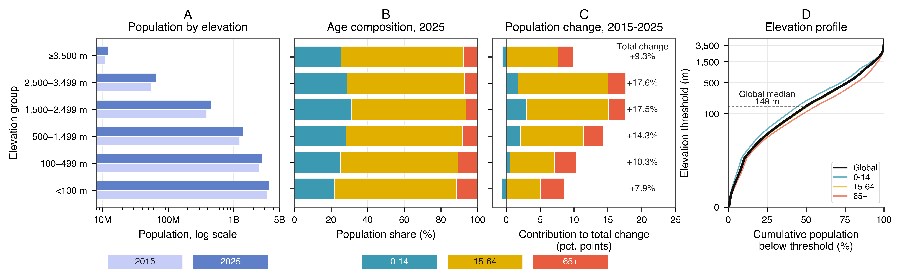
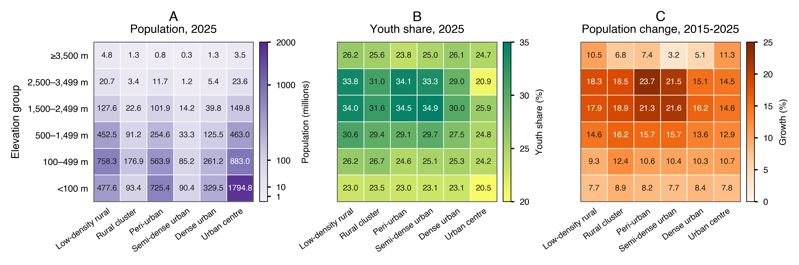

# Hypsographic Demography Revisited

[](LICENSE.md)
[](CITATION.cff)

This repository supports the paper **“Hypsographic Demography Revisited: Age Structure and Population Change by Elevation.”** It contains the derived CSV tables, figure-reproduction notebook, and final figure outputs used in the manuscript.

<p align="center">
  
</p>

<p align="center">
  
</p>

## Repository contents

- `notebooks/01_reproduce_figures.ipynb`: reproduces the two main manuscript figures.
- `outputs/figures/`: final figures as PNG and PDF.
- `outputs/supplementary/dataset_s1/`: CSV source data for the main figures and headline values.
- `outputs/supplementary/dataset_s2/`: sample CSV robustness and sensitivity tables.
- `data/`: compact derived inputs used by the figure notebook and provided supplementary tables.
- `processing/`: scripts documenting the derived-table workflow.
- `scripts/`: utilities for packaging supplementary CSV files.

## Data sources

The analysis uses public gridded datasets:

- WorldPop Global 2 annual age-sex population estimates.
- GMTED2010 mean elevation.
- GHS-SMOD R2023A settlement classification.

The full gridded source products are not included because of file size. This repository provides the compact derived tables needed to reproduce the manuscript figures and supplementary checks.

## Reproduce the figures

Create a Python environment and launch the figure notebook:

```bash
python -m venv .venv
source .venv/bin/activate
pip install -r requirements.txt
jupyter lab notebooks/01_reproduce_figures.ipynb
```
