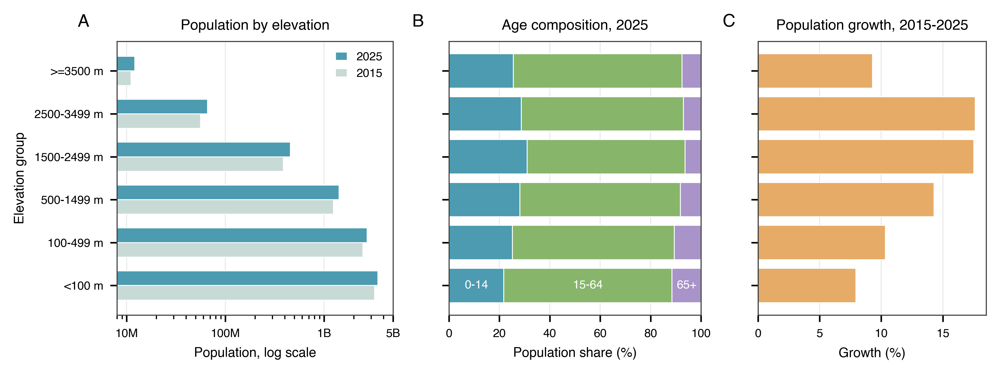
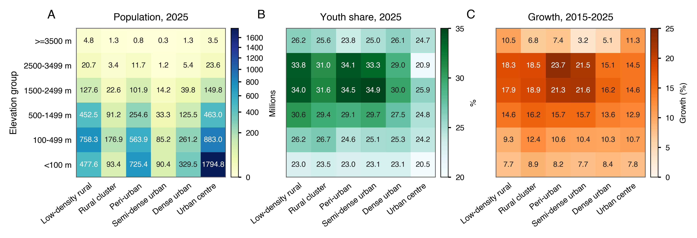

# Hypsographic Demography: Age and Change in Population by Altitude

[](LICENSE.md)
[](CITATION.cff)

This repository supports the manuscript **"Hypsographic Demography: Age and Change in Population by Altitude."**

It contains the analysis-ready data used to generate the two main figures, a notebook to reproduce those figures, and lightweight processing scripts documenting how the analysis tables were created from public gridded population, elevation, and settlement datasets.

<p align="center">
  
</p>

<p align="center">
  
</p>


## Repository contents

- `data/dataset_s1_hypsographic_demography.csv`: Dataset S1 for the two main figures and attribution diagnostic.
- `notebooks/01_reproduce_figures.ipynb`: figure reproduction notebook.
- `outputs/figures/`: final main figures as PNG and PDF.
- `outputs/tables/`: figure tables and manuscript values.
- `processing/`: short scripts and notes documenting the upstream preparation workflow.

## Data sources

The analysis uses:

- WorldPop Global 2 annual age-sex population estimates, 2015–2030.
- GMTED2010 mean elevation, 30 arc-second.
- GHS-SMOD R2023A settlement classification.

The full gridded source products are not included in this repository. Processing notes document the expected inputs and alignment logic.

## Main analysis choices

- Elevation groups: `<100 m`, `100–499 m`, `500–1499 m`, `1500–2499 m`, `2500–3499 m`, and `>=3500 m`.
- Inhabited highlands are summarized as `1500–3500 m`.
- Broad age groups: `0–14`, `15–64`, and `65+`.
- `static_2025` attribution is used for the main 2015–2025 growth summaries: 2025 elevation and settlement classes are held fixed across the interval.
- Dynamic attribution is kept only as a robustness diagnostic for the settlement-growth matrix.
- 2015–2025 differences are modeled gridded population change, not direct observations of births, deaths, or migration.

## Reproduce figures

```bash
python -m venv .venv
source .venv/bin/activate
pip install -r requirements.txt
jupyter lab notebooks/01_reproduce_figures.ipynb